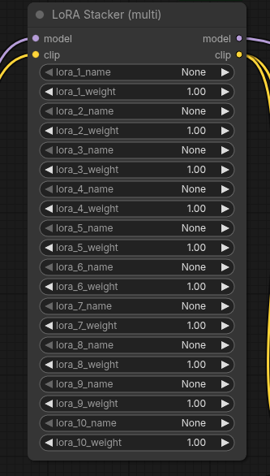

# ComfyUI LoRA Stacker

A simple ComfyUI custom node that lets you apply multiple LoRAs (up to 10) to a `MODEL` + `CLIP` in one node.

## Features

- Stack up to 10 LoRAs with individual weights
- UI button **Add LoRA** to reveal additional LoRA rows
- Uses the standard ComfyUI LoRA folder (`models/loras`)

## Installation

1. Go to your ComfyUI `custom_nodes` folder.
2. Clone this repository:

   ```bash
   git clone https://github.com/zwaigani/ComfyUI-LoRA-stacker.git
   ```

3. Restart ComfyUI.

## Dependencies

- Uses ComfyUI's built-in `torch` and loader utilities (no extra pip deps).

## Troubleshooting

- **"LoRA not found"**
   - The selected file doesn't exist under ComfyUI's LoRA folder (usually `ComfyUI/models/loras`).
   - Make sure the filename matches and the file is in the expected folder.
- **This node must be run inside ComfyUI**
   - Importing the node module outside ComfyUI will fail because it expects ComfyUI's runtime modules.

## License

MIT License. See [LICENSE](LICENSE).

## Changelog / Releases

- Changes are tracked in [CHANGELOG.md](CHANGELOG.md).
- For a new release: update `CHANGELOG.md`, create a git tag (e.g. `v1.0.1`), then publish a GitHub Release for that tag.

## Usage

- Add the node **LoRA Stacker (multi)** (node id: `LoRA Stacker`) from category `loaders`.
- Connect your `MODEL` and `CLIP`.
- Select `lora_1_name` + set `lora_1_weight`.
- Click **Add LoRA** to show `lora_2_*` … `lora_10_*`.
- Setting a LoRA name to `None` or weight to `0` skips it.

Note: The screenshot path in this README expects an image at `images/lora-stacker.png`.

---

# ComfyUI LoRA Stacker（日本語）

`MODEL` と `CLIP` に対して、複数の LoRA（最大 10 個）を 1 つのノードで適用できる ComfyUI カスタムノードです。

## 特徴

- 最大 10 個の LoRA を個別の重みで積み重ね可能
- **Add LoRA** ボタンで LoRA 行を追加表示
- ComfyUI 標準の LoRA フォルダ（`models/loras`）を利用

## インストール

1. ComfyUI の `custom_nodes` フォルダへ移動します。
2. このリポジトリを clone します：

   ```bash
   git clone https://github.com/zwaigani/ComfyUI-LoRA-stacker.git
   ```

3. ComfyUI を再起動します。

## 使い方

- カテゴリ `loaders` の **LoRA Stacker (multi)**（ノードID: `LoRA Stacker`）を追加します。
- `MODEL` と `CLIP` を接続します。
- `lora_1_name` と `lora_1_weight` を設定します。
- **Add LoRA** を押すと `lora_2_*` 〜 `lora_10_*` が表示されます。
- LoRA 名が `None`、または重みが `0` のものはスキップされます。

注：この README の先頭画像は `images/lora-stacker.png` を参照しています。

## 依存関係

- ComfyUI 環境に含まれる `torch` やローダー機能を利用します（追加の pip 依存はありません）。

## トラブルシュート

- **"LoRA not found" が出る**
   - 選択した LoRA ファイルが ComfyUI の LoRA フォルダ（通常 `ComfyUI/models/loras`）に存在しません。
   - ファイル名の一致と配置フォルダを確認してください。
- **"This node must be run inside ComfyUI" が出る**
   - ComfyUI の実行環境外で import すると、ComfyUI のモジュールが無いためエラーになります。

## ライセンス

MIT License（[LICENSE](LICENSE)）。
